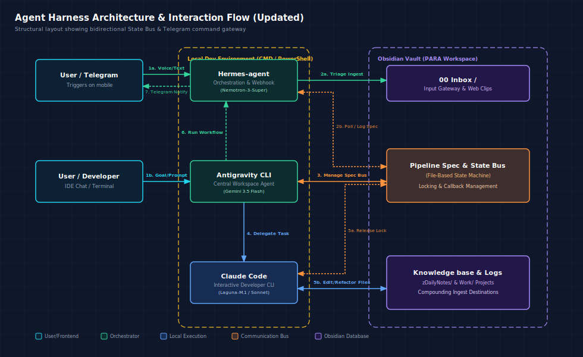

# ⚙️ Agent Harness Architecture & Interaction Flow

A lightweight, local-first, file-based multi-agent orchestration framework that integrates Obsidian (Second Brain), Telegram, and local developer CLIs (like Antigravity CLI and Claude Code) using Markdown as a state machine.



---

## 💡 Core Concept: What is an Agent Harness?
An **Agent Harness** (or Agent Runtime) is the "body" that wraps an LLM "brain". While LLMs are excellent at reasoning, they lack a safe physical interface to interact with operating systems and local directories. 

The harness acts as a safe middleware, providing:
1. **Isolated Sandbox Environment**: Restricts filesystems and prevents destructive commands.
2. **Tool Execution & Interception**: Traps agent tool calls (e.g. file edits, bash commands), executes them locally, and feeds stdout/stderr back into the model's context.
3. **Security Gatekeeper (Human-in-the-Loop)**: Intercepts high-risk commands (like `git push` or system-level changes) and prompts the user for approval.
4. **State & Telemetry Management**: Records action trajectories for auditability and debuggability.

---

## 🏗️ Multi-Agent Interaction Flow
Instead of using complex API backends (like FastAPIs, databases, Redis, or Celery queues), this architecture uses **Obsidian (Markdown)** as a **Stateful Communication Bus**.

```mermaid
sequenceDiagram
    autonumber
    actor User as "User / Mobile Telegram"
    participant Hermes as "Hermes-agent (Telegram Bot)"
    participant AGY as "Antigravity CLI (Gemini)"
    participant Claude as "Claude Code (Sonnet)"
    database Vault as "Obsidian Vault (Markdown Specs)"

    User->>Hermes: 1 Send Voice/Text Command
    Hermes->>Vault: 2 Ingest Raw Capture to 00 Inbox/
    User->>AGY: 3 Initialize Goal/Task (via IDE or Terminal)
    AGY->>Vault: 4 Create Pipeline Spec (State: Ready)
    
    rect rgb(30, 41, 59)
        note right of AGY: File-Based State Machine Loop
        AGY->>Vault: 5 Acquire Lock (Lock: Antigravity, State: Running)
        AGY->>Claude: 6 Delegate Task (Draft Spec Contract in Inbox)
        Claude->>Vault: 7 Perform Work, Release Lock, Update Spec State
        Vault-->>AGY: 8 Poll Result & Update Main Status
    end
    
    AGY->>Hermes: 9 Trigger Finish Callback Notification
    Hermes-->>User: 10 Send Telegram Success Alert
```

---

## 📋 Stateful Pipeline Spec & File Locking
Multi-agent systems accessing the same directory face **Race Conditions** (where two agents write to the same daily note or project file concurrently). 

This architecture resolves this with a **File Locking Protocol** defined in the Pipeline Spec YAML metadata:

```yaml
---
type: project/pipeline
title: "Pipeline Spec - Feature Deploy"
lock:
  owner: "Antigravity"  # 'Antigravity' | 'Claude' | 'Hermes' | 'None'
  timestamp: "02-07-2026 10:00:00"
status: "Running"
---
```

### Locking Rules:
1. **Acquire**: Before modifying any project files, an agent must parse the `lock.owner` field. If it is `None` or matches their identifier, they write their ID to `lock.owner` and proceed.
2. **Queue/Wait**: If `lock.owner` is held by another agent, the requesting agent pauses and polls (State Polling) until the lock is released.
3. **Release**: Once the subtask is completed, the executing agent sets `lock.owner` to `None` (or handovers to the next agent) and updates the phase state to `[x]`.

---

## 📂 Project Repository Structure
This repository contains the building blocks to set up your own file-based agent harness:

*   `/templates`: Contains generic templates for `Pipeline Spec` and `Design Contracts`.
*   `/examples`: Mock script setups demonstrating how two CLI tools coordinate changes asynchronously using Markdown files.
*   `/scripts`: Basic file-watching and sanitization scripts to prevent secrets leakage.
*   `/docs`: System architecture diagrams and deep-dives.

---

## 🛡️ Security & Privacy Guardrails
When exposing local CLI agents (which have access to terminal commands) to external webhooks (like Telegram mobile notifications), safety is paramount. 
*   **Inbox Gateway Isolation**: Mobile interactions (Hermes Telegram Bot) are restricted to writing *only* to the `00 Inbox/` folder. They cannot modify core project source codes or Areas directories directly.
*   **Ingest Verification**: The main local orchestrator (Antigravity CLI) acts as the triage gateway, parsing inbox items, checking for conflicts, and compiling them into clean files.
*   **Pre-Commit Sanitizer**: Scripts (like `sanitize_repo.py`) scan the release directories prior to execution to ensure no local hardcoded absolute paths, API keys, or usernames are leaked to public repositories.

---
*Created as part of AI Developer's Second Brain Workspace.*
